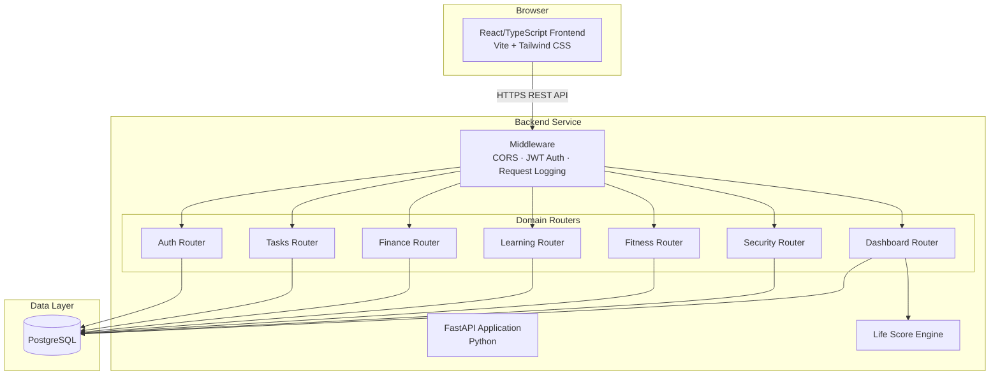
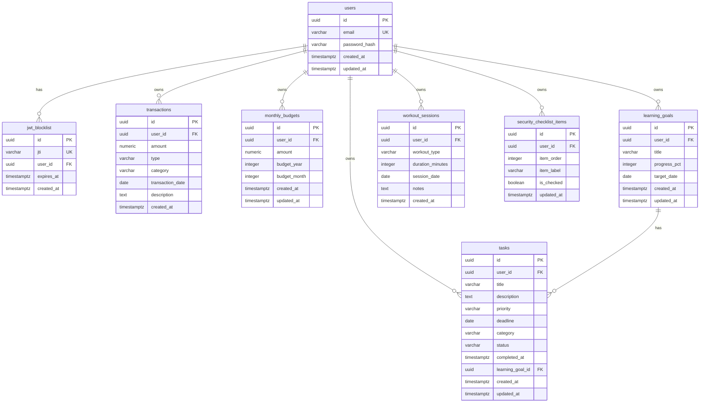
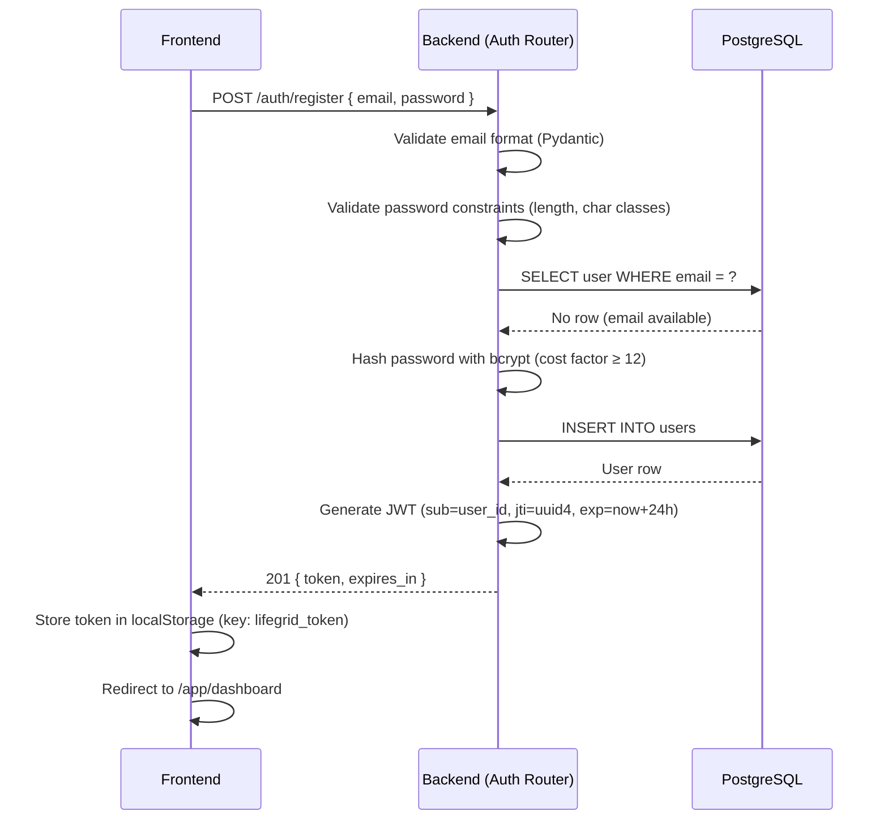
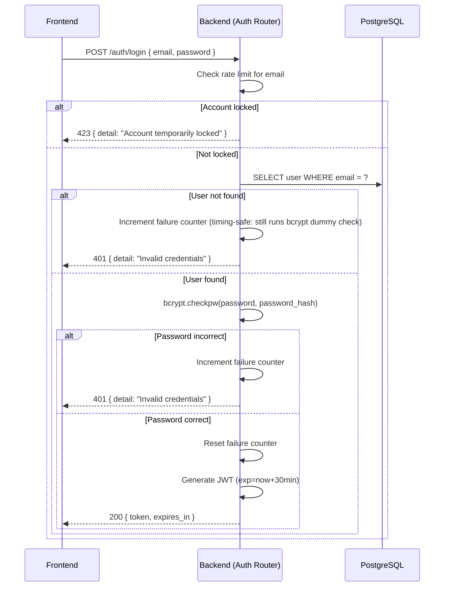
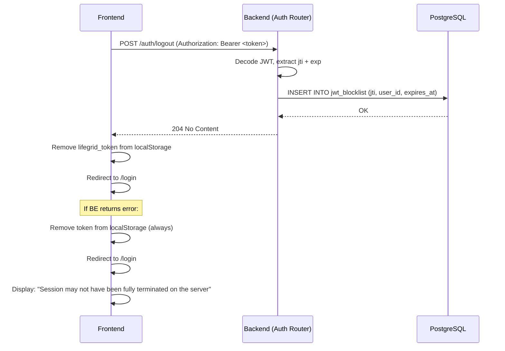

# Design Document: LifeGrid

## Overview

LifeGrid is a privacy-conscious personal life management dashboard for university students and young adults. It unifies five life management areas — productivity, personal finance, personal development, fitness, and personal security — into a single cohesive full-stack web application. The central question LifeGrid answers is: **"What should I focus on today?"**

The system is a monolithic full-stack application composed of three distinct layers:

- **Frontend**: React 18 with TypeScript (strict mode), Vite as the build tool, and Tailwind CSS for styling.
- **Backend**: Python with FastAPI, organized as a single monolithic service with domain-separated routers.
- **Database**: PostgreSQL as the sole persistent data store.

All user data is private to the owning user. There are no AI components, no external financial or health API integrations, and no microservices. The architecture prioritizes simplicity, data ownership, and maintainability over extensibility.

---

## Architecture

### High-Level Architecture Diagram



### Architectural Decisions

| Decision | Choice | Rationale |
|---|---|---|
| Deployment topology | Monolith | Simplicity for an MVP targeting a single developer; no operational overhead of service mesh |
| Frontend/Backend separation | Separate processes | Clear API boundary; frontend can be deployed to a CDN independently |
| Authentication mechanism | JWT (Bearer token) | Stateless; suitable for REST APIs; no session server required |
| Server-side JWT invalidation | Blocklist table in PostgreSQL | Satisfies Requirement 3.2 without a Redis dependency |
| Currency | IDR only | Defined scope in requirements; avoids multi-currency complexity |
| No AI/ML | Rule-based Life Score | Transparency, determinism, and no external model dependencies |

---

## Components and Interfaces

### Frontend Component Organization

```
src/
├── main.tsx                        # Vite entry point
├── App.tsx                         # Root component, router setup
├── router/
│   └── index.tsx                   # React Router v6 route definitions
├── api/
│   ├── client.ts                   # Axios instance with base URL + auth header interceptor
│   ├── auth.ts                     # Auth API calls (register, login, logout)
│   ├── tasks.ts                    # Task API calls
│   ├── finance.ts                  # Finance API calls
│   ├── learning.ts                 # Learning API calls
│   ├── fitness.ts                  # Fitness API calls
│   ├── security.ts                 # Security API calls
│   └── dashboard.ts                # Dashboard + Life Score API calls
├── store/
│   ├── auth.store.ts               # Auth state (token, user identity)
│   └── index.ts                    # Store exports
├── hooks/
│   ├── useAuth.ts                  # Auth state access + login/logout actions
│   ├── useTasks.ts                 # Task data fetching and mutations
│   ├── useFinance.ts               # Finance data fetching and mutations
│   ├── useLearning.ts              # Learning data fetching and mutations
│   ├── useFitness.ts               # Fitness data fetching and mutations
│   ├── useSecurity.ts              # Security checklist data and mutations
│   └── useDashboard.ts             # Dashboard aggregated data
├── components/
│   ├── shared/
│   │   ├── Button.tsx
│   │   ├── Input.tsx
│   │   ├── Card.tsx
│   │   ├── Modal.tsx
│   │   ├── EmptyState.tsx
│   │   ├── ErrorBoundary.tsx
│   │   ├── ErrorCard.tsx
│   │   ├── LoadingSpinner.tsx
│   │   ├── Badge.tsx
│   │   └── ProgressBar.tsx
│   ├── layout/
│   │   ├── AppLayout.tsx           # Sidebar + main content wrapper
│   │   ├── Sidebar.tsx             # Navigation links to all modules
│   │   └── TopBar.tsx              # User info + logout button
│   ├── dashboard/
│   │   ├── DashboardPage.tsx
│   │   ├── LifeScoreCard.tsx
│   │   ├── TasksSummaryCard.tsx
│   │   ├── FinanceSummaryCard.tsx
│   │   ├── LearningSummaryCard.tsx
│   │   ├── FitnessSummaryCard.tsx
│   │   └── SecuritySummaryCard.tsx
│   ├── tasks/
│   │   ├── TasksPage.tsx
│   │   ├── TaskList.tsx
│   │   ├── TaskItem.tsx
│   │   ├── TaskForm.tsx
│   │   └── TaskFilters.tsx
│   ├── finance/
│   │   ├── FinancePage.tsx
│   │   ├── TransactionList.tsx
│   │   ├── TransactionForm.tsx
│   │   ├── BudgetForm.tsx
│   │   ├── MonthlySummary.tsx
│   │   └── SpendingBreakdown.tsx
│   ├── learning/
│   │   ├── LearningPage.tsx
│   │   ├── GoalList.tsx
│   │   ├── GoalItem.tsx
│   │   ├── GoalForm.tsx
│   │   └── GoalTaskList.tsx
│   ├── fitness/
│   │   ├── FitnessPage.tsx
│   │   ├── WorkoutList.tsx
│   │   ├── WorkoutForm.tsx
│   │   └── WeeklySummary.tsx
│   ├── security/
│   │   ├── SecurityPage.tsx
│   │   ├── ChecklistItem.tsx
│   │   └── ChecklistProgress.tsx
│   └── auth/
│       ├── LoginPage.tsx
│       ├── RegisterPage.tsx
│       └── ProtectedRoute.tsx
└── types/
    ├── auth.types.ts
    ├── task.types.ts
    ├── finance.types.ts
    ├── learning.types.ts
    ├── fitness.types.ts
    ├── security.types.ts
    └── dashboard.types.ts
```

### Frontend Routing

React Router v6 is used for client-side routing. All routes under `/app/*` are wrapped by `ProtectedRoute`, which reads the JWT from storage and redirects to `/login` if absent or expired.

| Path | Component | Auth Required |
|---|---|---|
| `/` | Redirect to `/app/dashboard` | No |
| `/login` | `LoginPage` | No |
| `/register` | `RegisterPage` | No |
| `/app/dashboard` | `DashboardPage` | Yes |
| `/app/tasks` | `TasksPage` | Yes |
| `/app/finance` | `FinancePage` | Yes |
| `/app/learning` | `LearningPage` | Yes |
| `/app/fitness` | `FitnessPage` | Yes |
| `/app/security` | `SecurityPage` | Yes |

### Frontend State Management

State management uses React's built-in primitives and custom hooks:

- **Auth state**: A lightweight store (Zustand or React Context) holds the decoded JWT payload and raw token. This is the single source of truth for "is the user logged in".
- **Server state**: Each module page fetches its own data using custom hooks wrapping `fetch`/`axios`. No global server state cache is required for the MVP — data is re-fetched on navigation.
- **Form state**: Local `useState` within form components. Form validation errors are also local state.

The API client (`api/client.ts`) uses an Axios instance configured with:
- Base URL from environment variable `VITE_API_BASE_URL`
- A request interceptor that reads the JWT from storage and sets the `Authorization: Bearer <token>` header on every request
- A response interceptor that catches 401 responses and clears the stored token, then redirects to `/login`

---

### Backend Component Organization

```
backend/
├── main.py                         # FastAPI app factory, middleware registration, router inclusion
├── config.py                       # Settings loaded from environment variables via Pydantic BaseSettings
├── database.py                     # SQLAlchemy engine, session factory, Base declarative
├── dependencies.py                 # Shared FastAPI dependencies (get_db, get_current_user)
├── models/
│   ├── user.py
│   ├── task.py
│   ├── finance.py
│   ├── learning.py
│   ├── fitness.py
│   ├── security.py
│   └── jwt_blocklist.py
├── schemas/
│   ├── auth.py                     # Pydantic request/response schemas for auth
│   ├── task.py
│   ├── finance.py
│   ├── learning.py
│   ├── fitness.py
│   ├── security.py
│   └── dashboard.py
├── routers/
│   ├── auth.py
│   ├── tasks.py
│   ├── finance.py
│   ├── learning.py
│   ├── fitness.py
│   ├── security.py
│   └── dashboard.py
├── services/
│   ├── auth_service.py             # Password hashing, JWT creation/validation, blocklist check
│   ├── task_service.py             # Task business logic
│   ├── finance_service.py          # Financial aggregations, budget computation
│   ├── learning_service.py         # Goal management
│   ├── fitness_service.py          # Workout queries, weekly summary
│   ├── security_service.py         # Checklist initialization and toggle
│   └── life_score_service.py       # Life Score formula computation
└── middleware/
    ├── cors.py                     # CORS configuration
    └── rate_limit.py               # Login rate limiting (in-memory counter or DB-backed)
```

### Dependency Injection Pattern

FastAPI's `Depends()` system is used throughout:

- `get_db()` — yields a SQLAlchemy session and closes it after the request
- `get_current_user(token: str = Depends(oauth2_scheme), db: Session = Depends(get_db))` — decodes JWT, checks blocklist, returns the `User` ORM object; raises HTTP 401 if token is invalid/expired/blocklisted
- `require_owner(resource_user_id, current_user)` — utility function (not a dependency) called inside route handlers to compare ownership and raise HTTP 403 if mismatch

All protected endpoints declare `current_user: User = Depends(get_current_user)`. This ensures the authorization check cannot be accidentally omitted.

---

## Data Models

### Entity Relationship Diagram



### Table Specifications

#### `users`
| Column | Type | Constraints | Notes |
|---|---|---|---|
| `id` | `UUID` | PK, default `gen_random_uuid()` | |
| `email` | `VARCHAR(254)` | NOT NULL, UNIQUE | Max RFC 5321 length |
| `password_hash` | `VARCHAR(128)` | NOT NULL | bcrypt hash output |
| `created_at` | `TIMESTAMPTZ` | NOT NULL, default `now()` | |
| `updated_at` | `TIMESTAMPTZ` | NOT NULL, default `now()` | Updated by trigger |

#### `jwt_blocklist`
| Column | Type | Constraints | Notes |
|---|---|---|---|
| `id` | `UUID` | PK | |
| `jti` | `VARCHAR(36)` | NOT NULL, UNIQUE | JWT ID claim |
| `user_id` | `UUID` | FK → users, NOT NULL | For cleanup on user deletion |
| `expires_at` | `TIMESTAMPTZ` | NOT NULL | Used for periodic cleanup |
| `created_at` | `TIMESTAMPTZ` | NOT NULL, default `now()` | |

Index: `(expires_at)` to support periodic cleanup of expired entries.

#### `tasks`
| Column | Type | Constraints | Notes |
|---|---|---|---|
| `id` | `UUID` | PK | |
| `user_id` | `UUID` | FK → users, NOT NULL | |
| `title` | `VARCHAR(255)` | NOT NULL | 1–255 chars |
| `description` | `TEXT` | nullable | |
| `priority` | `VARCHAR(10)` | NOT NULL, default `'medium'` | `low`, `medium`, `high` |
| `deadline` | `DATE` | nullable | ISO 8601 date |
| `category` | `VARCHAR(100)` | nullable | |
| `status` | `VARCHAR(20)` | NOT NULL, default `'incomplete'` | `incomplete`, `completed` |
| `completed_at` | `TIMESTAMPTZ` | nullable | Set on completion, cleared on revert |
| `learning_goal_id` | `UUID` | FK → learning_goals, nullable | Optional association |
| `created_at` | `TIMESTAMPTZ` | NOT NULL, default `now()` | |
| `updated_at` | `TIMESTAMPTZ` | NOT NULL, default `now()` | |

Indexes: `(user_id)`, `(user_id, deadline)` for date-filtered queries, `(user_id, status)`.

#### `transactions`
| Column | Type | Constraints | Notes |
|---|---|---|---|
| `id` | `UUID` | PK | |
| `user_id` | `UUID` | FK → users, NOT NULL | |
| `amount` | `NUMERIC(16,2)` | NOT NULL, CHECK > 0 | IDR, 2dp precision |
| `type` | `VARCHAR(10)` | NOT NULL | `income`, `expense` |
| `category` | `VARCHAR(100)` | NOT NULL | |
| `transaction_date` | `DATE` | NOT NULL | |
| `description` | `VARCHAR(500)` | nullable | |
| `created_at` | `TIMESTAMPTZ` | NOT NULL, default `now()` | |

Indexes: `(user_id)`, `(user_id, transaction_date)` for monthly aggregations.

#### `monthly_budgets`
| Column | Type | Constraints | Notes |
|---|---|---|---|
| `id` | `UUID` | PK | |
| `user_id` | `UUID` | FK → users, NOT NULL | |
| `amount` | `NUMERIC(14,0)` | NOT NULL, CHECK > 0 | Integer IDR up to max |
| `budget_year` | `INTEGER` | NOT NULL | |
| `budget_month` | `INTEGER` | NOT NULL, CHECK 1–12 | |
| `created_at` | `TIMESTAMPTZ` | NOT NULL, default `now()` | |
| `updated_at` | `TIMESTAMPTZ` | NOT NULL, default `now()` | |

Unique constraint: `(user_id, budget_year, budget_month)` — one budget per user per month (upsert semantics).

#### `learning_goals`
| Column | Type | Constraints | Notes |
|---|---|---|---|
| `id` | `UUID` | PK | |
| `user_id` | `UUID` | FK → users, NOT NULL | |
| `title` | `VARCHAR(200)` | NOT NULL | |
| `progress_pct` | `INTEGER` | NOT NULL, default 0, CHECK 0–100 | |
| `target_date` | `DATE` | NOT NULL | Must be after creation date |
| `created_at` | `TIMESTAMPTZ` | NOT NULL, default `now()` | |
| `updated_at` | `TIMESTAMPTZ` | NOT NULL, default `now()` | |

Index: `(user_id)`, `(user_id, progress_pct)` for active goal filtering.

#### `workout_sessions`
| Column | Type | Constraints | Notes |
|---|---|---|---|
| `id` | `UUID` | PK | |
| `user_id` | `UUID` | FK → users, NOT NULL | |
| `workout_type` | `VARCHAR(100)` | NOT NULL | |
| `duration_minutes` | `INTEGER` | NOT NULL, CHECK 1–1440 | |
| `session_date` | `DATE` | NOT NULL | Cannot be in the future |
| `notes` | `VARCHAR(500)` | nullable | |
| `created_at` | `TIMESTAMPTZ` | NOT NULL, default `now()` | |

Indexes: `(user_id)`, `(user_id, session_date)` for weekly aggregations.

#### `security_checklist_items`
| Column | Type | Constraints | Notes |
|---|---|---|---|
| `id` | `UUID` | PK | |
| `user_id` | `UUID` | FK → users, NOT NULL | |
| `item_order` | `INTEGER` | NOT NULL | 1–5, determines display order |
| `item_label` | `VARCHAR(200)` | NOT NULL | Fixed text, set on initialization |
| `is_checked` | `BOOLEAN` | NOT NULL, default `false` | |
| `updated_at` | `TIMESTAMPTZ` | NOT NULL, default `now()` | |

Unique constraint: `(user_id, item_order)`. All 5 rows are inserted when a user first accesses the Security Center.

---

## REST API Structure

All endpoints are prefixed with `/api/v1`. All protected endpoints require `Authorization: Bearer <token>` header. All request and response bodies are `application/json`. Pydantic models define all schemas.

### Authentication (`/api/v1/auth`)

| Method | Path | Auth | Description |
|---|---|---|---|
| `POST` | `/auth/register` | No | Register new user |
| `POST` | `/auth/login` | No | Login, receive JWT |
| `POST` | `/auth/logout` | Yes | Invalidate JWT server-side |

**POST /auth/register**
Request: `{ email, password }`
Response 201: `{ id, email, token, token_type: "bearer", expires_in }`
Errors: 409 (duplicate email), 422 (validation failure)

**POST /auth/login**
Request: `{ email, password }`
Response 200: `{ token, token_type: "bearer", expires_in }`
Errors: 401 (invalid credentials, opaque message), 423 (account locked — rate limit exceeded)

**POST /auth/logout**
Request: `{}` (token from header)
Response 204
Errors: 401 (invalid token)

---

### Tasks (`/api/v1/tasks`)

| Method | Path | Auth | Description |
|---|---|---|---|
| `POST` | `/tasks` | Yes | Create task |
| `GET` | `/tasks` | Yes | List tasks (with filter query params) |
| `GET` | `/tasks/{id}` | Yes | Get single task |
| `PATCH` | `/tasks/{id}` | Yes | Update task fields |
| `DELETE` | `/tasks/{id}` | Yes | Delete task |
| `PATCH` | `/tasks/{id}/complete` | Yes | Mark task complete |
| `PATCH` | `/tasks/{id}/incomplete` | Yes | Mark task incomplete |

Query params for `GET /tasks`: `filter=today|overdue|all` (default `all`), `learning_goal_id=<uuid>`.

**Task object shape:**
`{ id, user_id, title, description, priority, deadline, category, status, completed_at, learning_goal_id, created_at, updated_at }`

---

### Finance (`/api/v1/finance`)

| Method | Path | Auth | Description |
|---|---|---|---|
| `POST` | `/finance/transactions` | Yes | Record transaction |
| `GET` | `/finance/transactions` | Yes | List transactions |
| `DELETE` | `/finance/transactions/{id}` | Yes | Delete transaction |
| `PUT` | `/finance/budgets/{year}/{month}` | Yes | Set/update monthly budget |
| `GET` | `/finance/budgets/{year}/{month}` | Yes | Get budget for month |
| `GET` | `/finance/summary/{year}/{month}` | Yes | Monthly financial summary |
| `GET` | `/finance/breakdown/{year}/{month}` | Yes | Spending breakdown by category |

**Transaction object:** `{ id, user_id, amount, type, category, transaction_date, description, created_at }`
**Budget object:** `{ id, user_id, amount, budget_year, budget_month }`
**Summary object:** `{ total_income, total_expenses, remaining_budget, budget_amount }`
**Breakdown item:** `{ category, total_amount }`

---

### Learning (`/api/v1/learning`)

| Method | Path | Auth | Description |
|---|---|---|---|
| `POST` | `/learning/goals` | Yes | Create learning goal |
| `GET` | `/learning/goals` | Yes | List active goals (progress < 100) |
| `PATCH` | `/learning/goals/{id}/progress` | Yes | Update progress percentage |
| `DELETE` | `/learning/goals/{id}` | Yes | Delete learning goal |

**Learning goal object:** `{ id, user_id, title, progress_pct, target_date, created_at, updated_at }`

---

### Fitness (`/api/v1/fitness`)

| Method | Path | Auth | Description |
|---|---|---|---|
| `POST` | `/fitness/sessions` | Yes | Record workout session |
| `GET` | `/fitness/sessions` | Yes | Workout history (sorted by date desc) |
| `GET` | `/fitness/summary/weekly` | Yes | This week's session count + total duration |

**Workout session object:** `{ id, user_id, workout_type, duration_minutes, session_date, notes, created_at }`
**Weekly summary object:** `{ session_count, total_duration_minutes, week_start, week_end }`

---

### Security (`/api/v1/security`)

| Method | Path | Auth | Description |
|---|---|---|---|
| `GET` | `/security/checklist` | Yes | Get checklist (initializes if first access) |
| `PATCH` | `/security/checklist/{item_id}` | Yes | Toggle item checked/unchecked |

**Checklist response:** `{ items: [{ id, item_order, item_label, is_checked }], checked_count, total_count }`

---

### Dashboard (`/api/v1/dashboard`)

| Method | Path | Auth | Description |
|---|---|---|---|
| `GET` | `/dashboard/summary` | Yes | All module summaries + Life Score |

**Dashboard summary object:**
```
{
  life_score: { total, task_points, finance_points, learning_points, fitness_points, security_points },
  tasks: { today_count, overdue_count },
  finance: { total_income, total_expenses, remaining_budget },
  learning: { active_goal_count, average_progress_pct },
  fitness: { weekly_session_count, weekly_total_duration_minutes },
  security: { checked_count, total_count, completion_pct }
}
```

Each sub-object may have an `error: true` flag if its data could not be retrieved; the endpoint always returns 200 with partial data rather than failing entirely.

---

## Authentication Flow

### Registration



### Login and Rate Limiting

The backend tracks failed login attempts per email address using a database-backed counter (or an in-memory dict for the MVP with the understanding it resets on restart). After 5 consecutive failures for an email, all subsequent attempts for that email are rejected with 423 for 15 minutes.



### JWT Structure

```
Header: { alg: "HS256", typ: "JWT" }
Payload: {
  sub: "<user_uuid>",
  jti: "<uuid4>",        // unique per token; used for blocklist
  iat: <issued_at>,
  exp: <expiry>
}
Signature: HMAC-SHA256(base64(header) + "." + base64(payload), JWT_SECRET)
```

The JWT secret is read from the `JWT_SECRET` environment variable at startup. If absent, the backend terminates immediately.

### Token Storage and Transport

- The frontend stores the JWT in `localStorage` under the key `lifegrid_token`.
- The Axios request interceptor reads this value and sets `Authorization: Bearer <token>` on every outgoing request.
- On a 401 response, the interceptor clears the stored token and redirects to `/login`.
- This design is pragmatic for an MVP. For higher security, `httpOnly` cookies could replace `localStorage` in a future iteration.

### Logout and Server-Side Invalidation



On every protected request, the `get_current_user` dependency checks the `jwt_blocklist` table for the token's `jti`. If found, it returns 401.

Expired blocklist entries are cleaned up by a periodic background task (APScheduler or a cron) that deletes rows where `expires_at < now()`.

### Protected Route Guard (Frontend)

`ProtectedRoute` is a wrapper component that:
1. Reads `lifegrid_token` from `localStorage`
2. Decodes the JWT payload (without verifying the signature — that is the backend's job)
3. Checks if `exp` is in the future
4. If valid: renders the child route
5. If missing or expired: redirects to `/login` and clears the stored token

---

## Authorization and Data Ownership

Every protected endpoint follows this pattern in sequence:

1. `get_current_user` dependency validates the JWT and returns the `User` object (raises 401 on failure)
2. The route handler fetches the requested resource by its ID
3. If the resource does not exist: return 404
4. `require_owner(resource.user_id, current_user.id)` is called: if `resource.user_id != current_user.id`, raise 403
5. The operation proceeds

This pattern is applied to all resource-level operations: task update/delete/complete, transaction delete, budget read/write, learning goal update/delete, workout session read, checklist item toggle.

The rule is: **no shared data exists in the MVP**. Every record is owned by exactly one user, and that user is the only one who can read or modify it.

---

## Life Score Calculation Algorithm

The Life Score is computed by `life_score_service.py` and exposed via the Dashboard endpoint. It is pure, deterministic arithmetic with no machine learning or external data.

### Formula

```
life_score = sum(floor(module_ratio × 20)) for each of 5 modules
```

Where each `module_ratio` is a float in [0.0, 1.0] and the maximum total is 100.

### Module Ratio Definitions

| Module | Metric | Ratio Formula | No-data Behavior |
|---|---|---|---|
| **Tasks** | Completion rate (current month) | `completed_tasks / total_tasks` | ratio = 0.0 |
| **Finance** | Budget adherence (current month) | `max(0, remaining_budget) / budget_amount` | ratio = 0.0 if no budget defined |
| **Learning** | Average goal progress | `average(progress_pct / 100)` across all active + recently completed goals | ratio = 0.0 if no goals |
| **Fitness** | Weekly workout activity | `min(1.0, weekly_session_count / 5)` — 5 sessions = full score | ratio = 0.0 if no sessions this week |
| **Security** | Checklist completion | `checked_count / 5` | ratio = 0.0 if checklist not initialized |

**Rationale for fitness formula**: 5 sessions per week is a reasonable target without being prescriptive; users can exceed it without penalty (capped at 1.0).

**Rationale for finance formula**: Overspending (negative remaining) clamps to 0 rather than allowing negative contribution; no module can contribute negative points to the total.

### Point Contribution Formula

```
module_points = floor(module_ratio × 20)
life_score = task_points + finance_points + learning_points + fitness_points + security_points
```

### Error Resilience

If the dashboard service cannot retrieve data for one or more modules (e.g., a DB query times out):
- The affected module's points default to the last successfully computed value cached in the dashboard response
- The dashboard returns the cached Life Score with a `score_stale: true` flag and a `stale_modules` list
- The frontend displays a notice: "Score may not reflect your latest activity"
- A partial score computed from fewer than 5 modules is never displayed as if it were a full score

### Score Breakdown Display

The frontend `LifeScoreCard` component displays:
- Total Life Score (0–100)
- A breakdown row for each module: name, input metric, formula, and points out of 20
- Disclaimer: "The Life Score is a personal productivity indicator only and does not constitute a medical, financial, psychological, or scientific assessment."

---

## Validation Strategy

### Backend Validation (Pydantic)

Every API endpoint defines explicit Pydantic `BaseModel` schemas for request bodies, query parameters, and path parameters. FastAPI automatically returns HTTP 422 with field-level error details when Pydantic validation fails.

**Key validation rules per domain:**

| Domain | Field | Rule |
|---|---|---|
| Auth | `email` | Valid email format (Pydantic `EmailStr`) |
| Auth | `password` | 8–128 chars; at least 1 uppercase, 1 lowercase, 1 digit |
| Tasks | `title` | 1–255 chars, non-empty |
| Tasks | `priority` | Enum: `low`, `medium`, `high`; default `medium` |
| Tasks | `deadline` | Valid `date`; must not be in the past |
| Tasks | `category` | 1–100 chars if provided |
| Finance | `amount` | `NUMERIC` > 0, ≤ 999,999,999,999.99 |
| Finance | `type` | Enum: `income`, `expense` |
| Finance | `category` | 1–100 chars |
| Finance | `transaction_date` | Valid `YYYY-MM-DD` date |
| Finance | `description` | ≤ 500 chars if provided |
| Budget | `amount` | Integer > 0, ≤ 999,999,999,999 |
| Budget | `budget_month` | Valid calendar month (1–12) |
| Learning | `title` | 1–200 chars |
| Learning | `target_date` | Valid ISO 8601 date after today |
| Learning | `progress_pct` | Integer 0–100 |
| Fitness | `workout_type` | 1–100 chars |
| Fitness | `duration_minutes` | Integer 1–1440 |
| Fitness | `session_date` | Valid date, not in the future |
| Fitness | `notes` | ≤ 500 chars if provided |

Custom Pydantic validators (using `@validator` or `@field_validator`) are used for rules that cannot be expressed by type alone (e.g., "deadline must not be in the past", "target_date must be after today", "session_date must not be in the future").

### Frontend Validation

Frontend form validation is performed on submit (and optionally on blur) before making API calls. This provides immediate feedback without a network round-trip:

- **Library**: React Hook Form with Zod for schema-based validation (mirrors the backend Pydantic schemas)
- **Error display**: Inline below each field using a consistent `<FieldError>` component
- **Strategy**: Validate on submit; re-validate on change after first submission attempt
- **Duplicate server errors**: If the backend returns a 422 or 409, the frontend maps the error response to the relevant form field and displays it inline

---

## Security Considerations

### Password Security

- Passwords are hashed using **bcrypt** with a cost factor of at least 12 before storage
- Plaintext passwords are never logged, stored, or returned in any response
- The backend performs a dummy bcrypt check when a login email is not found (to prevent timing-based email enumeration)

### JWT Security

- JWTs are signed with **HMAC-SHA256** using the `JWT_SECRET` environment variable
- The signing secret must be at least 32 bytes of cryptographic randomness
- Each token includes a unique `jti` (JWT ID) for blocklist-based invalidation on logout
- Access token expiry: 15–60 minutes (configured via `JWT_ACCESS_TOKEN_EXPIRE_MINUTES` env var)
- Registration token expiry: 24 hours (as specified by Requirement 1.6)

### HTTPS and Transport Security

- All API responses are served over HTTPS in production
- HTTP requests are rejected or redirected to HTTPS
- CORS is configured in FastAPI's `CORSMiddleware` to allow only the known frontend origin (configured via `ALLOWED_ORIGINS` env var)

### Secret Management

- All secrets (database URL, JWT secret, any future API keys) are read exclusively from environment variables via Pydantic `BaseSettings`
- If any required environment variable is absent at startup, the application raises an explicit error and terminates before binding to any port
- No secrets are committed to source control; an `.env.example` file with placeholder values is provided

### Login Rate Limiting

- After 5 consecutive failed login attempts for an email address, the account is locked for 15 minutes
- The lock state is stored in the database (`failed_attempts` count + `locked_until` timestamp on the `users` table, or in a separate `login_attempts` table)
- The lockout response (423) does not reveal whether the email exists

### SQL Injection Prevention

- All database queries use SQLAlchemy ORM or parameterized statements; no raw string interpolation in queries

### Data Isolation

- Every query that reads user-owned data includes a `WHERE user_id = :current_user_id` clause
- The `require_owner` check is applied before any write or delete operation at the application layer, even though the DB query already scopes by user

---

## Correctness Properties

*A property is a characteristic or behavior that should hold true across all valid executions of a system — essentially, a formal statement about what the system should do. Properties serve as the bridge between human-readable specifications and machine-verifiable correctness guarantees.*

The following properties target the pure computational logic of LifeGrid — validation functions, financial aggregations, Life Score formula, and data filtering. These are amenable to property-based testing because they are deterministic functions over a large input space where input variation reveals edge cases.

---

### Property 1: Password Validation Rejects Any Non-Conforming Password

*For any* string that is shorter than 8 characters, longer than 128 characters, or missing at least one uppercase letter, one lowercase letter, or one digit, the password validator SHALL reject the input and return an error indicating which constraint was violated.

**Validates: Requirements 1.3**

---

### Property 2: Password Validation Accepts Any Conforming Password

*For any* string that is between 8 and 128 characters (inclusive) and contains at least one uppercase letter, one lowercase letter, and one digit, the password validator SHALL accept the input without error.

**Validates: Requirements 1.3**

---

### Property 3: Data Ownership Isolation

*For any* user A, any user B where A ≠ B, and any resource owned by user B, when user A attempts to read, modify, or delete that resource, the system SHALL return an authorization error (403 Forbidden) and leave the resource unchanged.

**Validates: Requirements 4.2, 6.4, 9.8, 12.6, 13.2**

---

### Property 4: Life Score Formula Correctness

*For any* five module ratios r₁, r₂, r₃, r₄, r₅ each in [0.0, 1.0], the Life Score computed by the Life_Score_Engine SHALL equal `floor(r₁×20) + floor(r₂×20) + floor(r₃×20) + floor(r₄×20) + floor(r₅×20)`, which is always an integer in [0, 100].

**Validates: Requirements 19.2**

---

### Property 5: Life Score Zero Contribution for Empty Modules

*For any* module that has no data, its contribution to the Life Score SHALL be exactly 0 points, and the total Life Score SHALL still be computed from all five modules (the other modules contributing normally).

**Validates: Requirements 19.6**

---

### Property 6: Financial Summary Aggregation Correctness

*For any* set of transaction records for a given user and month, the financial summary SHALL return total_income equal to the sum of all `income`-typed transaction amounts, total_expenses equal to the sum of all `expense`-typed transaction amounts, and remaining_budget equal to `budget_amount - total_expenses` where budget_amount is the defined monthly budget (or 0 if none is defined).

**Validates: Requirements 11.1, 10.5**

---

### Property 7: Spending Breakdown Partition Correctness

*For any* set of expense transactions for a given user and month, the spending breakdown SHALL return exactly one entry per unique category, where each entry's total_amount equals the sum of all expense transaction amounts in that category, and the sum of all category totals equals the total_expenses in the financial summary.

**Validates: Requirements 11.3**

---

### Property 8: Task Date Filter Correctness

*For any* set of tasks for a given user, when filtered by `today`, the result SHALL contain exactly the tasks whose deadline equals the current calendar date and whose status is `incomplete`. When filtered by `overdue`, the result SHALL contain exactly the tasks whose deadline is strictly before the current calendar date and whose status is `incomplete`.

**Validates: Requirements 8.1, 8.2**

---

### Property 9: Task Completion Toggle is a Round-Trip

*For any* task in `incomplete` status, marking it complete then immediately marking it incomplete SHALL restore the task to `incomplete` status with no `completed_at` timestamp, leaving all other fields unchanged.

**Validates: Requirements 7.2**

---

### Property 10: Idempotent Completion Operations

*For any* task, marking it complete when it is already complete, or incomplete when it is already incomplete, SHALL return a success response and leave the task state unchanged (same status, same `completed_at` value).

**Validates: Requirements 7.4**

---

### Property 11: Workout History Sort Order

*For any* set of workout sessions for a given user, the workout history endpoint SHALL return all sessions sorted by `session_date` in descending order (most recent first), with no sessions belonging to other users included.

**Validates: Requirements 16.1, 16.3**

---

### Property 12: Weekly Workout Summary Boundary Correctness

*For any* set of workout sessions for a given user, the weekly summary SHALL count only sessions whose `session_date` falls within the current ISO calendar week (Monday to Sunday inclusive), and the total_duration_minutes SHALL equal the sum of `duration_minutes` for those sessions.

**Validates: Requirements 16.2**

---

### Property 13: Active Learning Goals Filter Correctness

*For any* set of learning goals for a given user, the active goals endpoint SHALL return exactly the goals with `progress_pct` in [0, 99] — goals with `progress_pct = 100` SHALL be excluded.

**Validates: Requirements 14.1**

---

### Property 14: Security Checklist Progress Indicator Correctness

*For any* security checklist state, the progress indicator SHALL display `checked_count / 5` where `checked_count` equals the number of items with `is_checked = true`, and `checked_count` SHALL always be an integer in [0, 5].

**Validates: Requirements 17.5**

---

### Property 15: Transaction Amount Precision Preservation

*For any* valid transaction amount (a positive decimal with at most 2 decimal places, ≤ 999,999,999,999.99), persisting and retrieving the transaction SHALL return a value numerically equal to the original amount with exactly 2 decimal places of precision.

**Validates: Requirements 9.6**

---

## Error Handling

### Backend Error Response Structure

All API errors follow a consistent shape:

```json
{
  "detail": "Human-readable error message",
  "code": "MACHINE_READABLE_CODE",
  "fields": { "field_name": "error description" }
}
```

`fields` is present only for validation errors (422). `code` enables the frontend to map errors to localized messages or specific UI behaviors without string matching.

### HTTP Status Code Conventions

| Status | Meaning | When Used |
|---|---|---|
| `200` | OK | Successful read or update |
| `201` | Created | Successful resource creation |
| `204` | No Content | Successful deletion or logout |
| `400` | Bad Request | Malformed request (non-Pydantic validation) |
| `401` | Unauthorized | Missing, expired, malformed, or blocklisted JWT |
| `403` | Forbidden | Valid JWT but requesting another user's resource |
| `404` | Not Found | Resource does not exist |
| `409` | Conflict | Duplicate email on registration |
| `422` | Unprocessable Entity | Pydantic validation failure (field-level errors) |
| `423` | Locked | Login rate limit exceeded |
| `500` | Internal Server Error | Unexpected database or application error |

### Frontend Error Handling

**API Client Layer:**
- The Axios response interceptor catches all non-2xx responses
- 401 responses trigger token clearance and redirect to `/login`
- Other errors are passed through to the calling hook/component as rejected promises

**Component Layer:**
- Each module page wraps its content in a React `ErrorBoundary` to catch unexpected render errors
- Data-fetching hooks return `{ data, isLoading, error }` state
- When `error` is set, the component renders an `ErrorCard` with a retry button
- Form submission errors are mapped to field-level or form-level error messages

**Dashboard Error Isolation:**
- Each summary card fetches its data independently (or reads from the aggregated dashboard response)
- If a card's data has `error: true`, it renders `ErrorCard` instead of the summary
- Other cards continue rendering normally — dashboard errors are non-propagating

### Empty States

Every list view and module card follows the `EmptyState` pattern when no data exists:

| Context | Empty State Message | Call-to-Action |
|---|---|---|
| Tasks (no tasks) | "No tasks yet — start by adding your first one" | "Add Task" button |
| Finance (no transactions) | "No transactions recorded this month" | "Add Transaction" button |
| Learning (no goals) | "No active goals — set one to get started" | "Add Goal" button |
| Fitness (no sessions) | "No workouts logged yet" | "Log Workout" button |
| Security (not initialized) | Checklist is auto-initialized on first access; no empty state | — |
| Dashboard card (no data) | Module-specific message with module name | Link to module page |

---

## Testing Strategy

### Dual Testing Approach

Testing uses two complementary strategies:

1. **Property-based tests** — verify universal properties hold across all inputs (using `hypothesis` for Python)
2. **Example-based unit and integration tests** — verify specific scenarios, edge cases, and infrastructure wiring (using `pytest` for Python, Vitest for TypeScript)

Together they achieve comprehensive coverage: property tests handle input space breadth, example tests handle concrete correctness and integration.

### Property-Based Testing (Backend — Python)

**Library**: `hypothesis` (Python)
**Minimum iterations**: 100 per property test (Hypothesis default; configured via `settings(max_examples=100)`)
**Scope**: Pure service functions — validators, aggregators, the Life Score formula, filter logic, sort logic

Each property-based test is tagged with a comment referencing the design property it validates:

```python
# Feature: lifegrid, Property 4: Life Score formula correctness
# Feature: lifegrid, Property 6: Financial summary aggregation correctness
```

**Property tests to implement:**

| Property | Function Under Test | Hypothesis Strategy |
|---|---|---|
| Property 1 + 2 | `validate_password(password: str)` | `st.text()` filtered/generated for conforming and non-conforming cases |
| Property 3 | `require_owner(resource_user_id, current_user_id)` | `st.uuids()` pairs where both sides are generated independently |
| Property 4 | `compute_life_score(ratios: list[float])` | `st.lists(st.floats(min_value=0.0, max_value=1.0), min_size=5, max_size=5)` |
| Property 5 | `compute_life_score` with zeros | Fixed 0.0 values in module positions |
| Property 6 | `compute_financial_summary(transactions, budget)` | `st.lists(transaction_strategy)` |
| Property 7 | `compute_spending_breakdown(transactions)` | `st.lists(expense_transaction_strategy)` |
| Property 8 | `filter_tasks_by_date(tasks, filter_type, today)` | `st.lists(task_strategy)` with `st.dates()` |
| Property 9 | Task completion service toggle logic | `st.builds(Task, ...)` with status = incomplete |
| Property 10 | Task completion service idempotence | `st.builds(Task, ...)` with both statuses |
| Property 11 | `sort_workouts_by_date(sessions)` | `st.lists(workout_session_strategy)` |
| Property 12 | `compute_weekly_summary(sessions, current_week)` | `st.lists(workout_session_strategy)` with `st.dates()` for week bounds |
| Property 13 | `filter_active_goals(goals)` | `st.lists(goal_strategy)` with progress in 0–100 |
| Property 14 | `compute_checklist_progress(items)` | `st.lists(st.booleans(), min_size=5, max_size=5)` |
| Property 15 | Transaction amount round-trip via Pydantic schema | `st.decimals(min_value=Decimal("0.01"), max_value=...)` |

### Example-Based and Integration Tests (Backend)

**Library**: `pytest` with `pytest-asyncio` for async routes, `httpx` for test client

**Coverage targets:**
- Auth: registration success, duplicate email, password validation failures (each constraint), login success, login with wrong password, login with nonexistent email, logout, blocklisted token rejection, rate limiting
- Authorization: missing JWT → 401, expired JWT → 401, cross-user resource access → 403
- Tasks: CRUD happy paths, each validation failure (empty title, bad priority, past deadline, bad category), filter=today, filter=overdue, completion toggle, idempotent completion
- Finance: transaction CRUD, missing fields, bad amount, bad type, budget upsert, monthly summary with and without data, spending breakdown
- Learning: goal CRUD, invalid progress, invalid target date, task association, task association with unowned goal
- Fitness: session creation, history, weekly summary week boundaries
- Security: first-access initialization, toggle checked, toggle unchecked, progress indicator
- Dashboard: summary endpoint with all modules having data, with some modules having no data, with one module erroring
- Life Score: formula correctness examples (spot checks), zero-data modules, error resilience

### Frontend Tests

**Library**: Vitest + React Testing Library

**Coverage targets:**
- `ProtectedRoute`: redirects to `/login` when no token; renders children when valid token
- `LoginPage`: form validation errors, successful login navigates to dashboard, error response displayed
- `RegisterPage`: password constraint validation, duplicate email error
- `ErrorBoundary`: renders fallback when child throws
- Life Score component: renders correct breakdown values for given score data
- Task filters: today/overdue filter UI updates query param
- Financial summary: renders correct IDR totals
- `EmptyState`: renders correct message and CTA per context

### Test Configuration Notes

- Property tests are run in CI alongside unit tests (`pytest` discovers all test files)
- Frontend tests run with `vitest --run` for single execution (no watch mode in CI)
- A separate `pytest` mark `@pytest.mark.integration` gates tests that require a live database connection; unit and property tests run without a DB using mocks or in-memory fakes
- Test database uses a dedicated PostgreSQL instance with schema applied via `alembic upgrade head` before the test session
